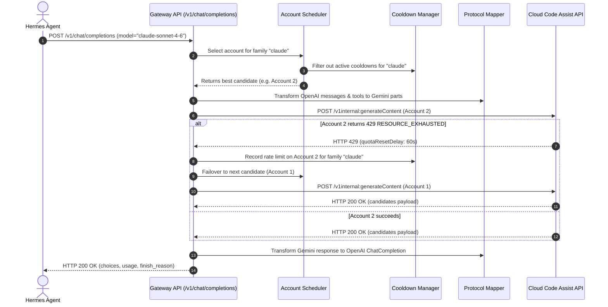

# Architecture Guide — Antigravity Gateway

This document outlines the internal architecture, component interactions, request lifecycle, and design principles of the Antigravity Multi-Account Gateway.

---

## 1. Operating Principle & Core Abstraction

The fundamental design rule of this system is that **Hermes Agent does not know or care which Google account is serving the request**.

Hermes asks:
> *"Give me model `gemini-3.5-flash`."*

The Gateway determines:
> *"Account 2 has valid authentication, 82% remaining quota, health score 98.5%, and is not currently on cooldown for the Gemini family. Route to Account 2."*

If Account 2 encounters a rate limit:
> *"Account 2 hit HTTP 429. Put Account 2's Gemini family on 60-second cooldown and seamlessly execute the request on Account 1."*

Hermes receives a seamless streaming or non-streaming response without error interruption.

---

## 2. Subsystem Layout

The gateway is built with clean layer separation:

```
src/agw/
├── main.py                     # Application factory & lifespan manager
├── config.py                   # YAML & ENV configuration
├── constants.py                # Endpoints, client metadata, models
├── auth/                       # OAuth PKCE flow & encrypted credential vault
│   ├── crypto.py               # Symmetric AES-256 Fernet encryption
│   ├── oauth.py                # Google OAuth authorization & token exchange
│   └── vault.py                # Disk-persisted encrypted token vault
├── db/                         # SQLite async persistence
│   ├── schema.py               # Tables: accounts, quota, cooldowns, usage, health
│   └── repository.py           # Async repository methods
├── cloudcode/                  # Upstream Google Cloud Code Assist integration
│   ├── client.py               # RPC client with fallback between daily & prod
│   ├── envelope.py             # Chat request envelope builder
│   ├── error_classifier.py     # HTTP 401/403/429/5xx classifier & cooldown calculator
│   └── schema_sanitizer.py     # Deep JSON schema cleaner for Gemini tool declarations
├── quota/                      # Quota collection & status reporting
│   ├── models.py               # Quota snapshot data structures
│   ├── monitor.py              # Background polling task
│   └── reporter.py             # Markdown generator for docs/account-status.md
├── routing/                    # Smart account scheduler & isolated cooldowns
│   ├── registry.py             # Model registry & upstream resolution
│   ├── cooldown.py             # Per-family cooldown manager with tiered backoff
│   ├── health.py               # Reliability & latency tracker
│   └── scheduler.py            # Hybrid weighted scoring scheduler
├── protocol/                   # OpenAI <-> Gemini protocol translation
│   ├── mapper.py               # Message & generation config mapping
│   ├── tools.py                # Function calling parameter & response mapping
│   ├── vision.py               # Image URL & base64 conversion to inlineData
│   └── streamer.py             # SSE chunk parser & delta transformer
├── api/                        # HTTP endpoints & security
│   ├── middleware.py           # Secret redactor, bearer auth, audit logging
│   ├── routes_v1.py            # OpenAI endpoints: /v1/models, /v1/chat/completions
│   ├── routes_auth.py          # OAuth endpoints: /auth/login, /auth/callback
│   └── routes_admin.py         # Admin endpoints: /admin/accounts, /admin/quota
├── dashboard/                  # Embedded administrative web dashboard
└── cli/                        # agw command-line administration tool
```

---

## 3. End-to-End Request Flow



---

## 4. Hybrid Selection Scoring Formula

The scheduler scores candidate accounts according to four weighted metrics:

$$\text{Score} = (\text{Health} \times W_h) + (\text{Tokens} \times W_t) + (\text{Quota} \times W_q) + (\text{LRU} \times W_{lru})$$

- **Health Score ($0 - 100$)**: Success percentage over the trailing 50 requests.
- **Token Capacity ($0 - 100$)**: Inverse of recent consecutive failures ($100 - (\text{failures} \times 30)$).
- **Quota Availability ($0 - 100$)**: Upstream remaining fraction ($\text{remainingFraction} \times 100$). Defaults to $50$ if unknown.
- **LRU Freshness ($0 - 100$)**: Time elapsed since last request, favoring accounts that have rested.
- **Priority Boost**: $+10$ points per configured priority increment.
